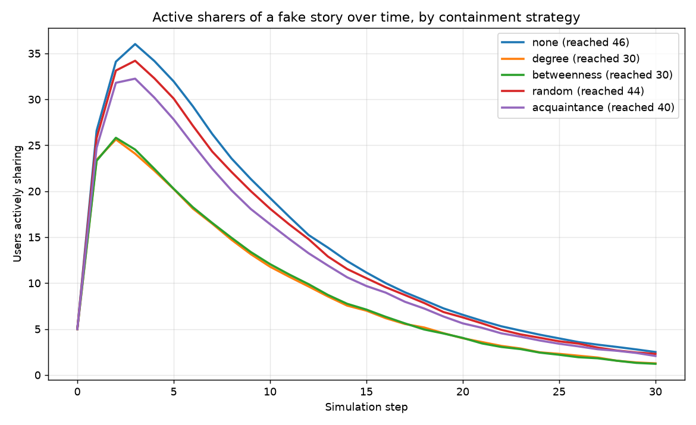

# Fake News Detection & Propagation Control

**Algorithms to spot fake news and stop it spreading across social media — an
end-to-end, runnable project with a step-by-step conceptual walkthrough.**

Misinformation is two problems, not one:

1. **Detection** — given a piece of text, decide whether it is *fake* or
   *credible*. This is a natural-language classification problem.
2. **Propagation control** — a story that is already loose on a social network
   spreads from user to user. Detecting it is useless unless you can also
   **slow or stop the cascade** with a limited budget of interventions. This is
   a graph / diffusion problem.

This repository tackles both, with clean code, unit tests, a CLI, a REST demo,
and — importantly — a conceptual explanation of *why* each algorithm works.

```
 text ─▶ preprocess ─▶ features ─▶ classifier ─▶ FAKE / REAL   (Part 1: detection)
                                        │
                                        ▼
        social graph ─▶ diffusion model ─▶ containment strategy   (Part 2: propagation)
```

---

## Table of contents

- [Quick start](#quick-start)
- [Part 1 — Spotting fake news](#part-1--spotting-fake-news)
  - [Step 1: The data](#step-1-the-data)
  - [Step 2: Preprocessing](#step-2-preprocessing)
  - [Step 3: Features — lexical + stylometric](#step-3-features--lexical--stylometric)
  - [Step 4: The classifier](#step-4-the-classifier)
  - [Step 5: Evaluation](#step-5-evaluation)
  - [Step 6: Explainability](#step-6-explainability)
- [Part 2 — Stopping propagation](#part-2--stopping-propagation)
  - [Step 1: Modelling the network](#step-1-modelling-the-network)
  - [Step 2: Modelling the spread](#step-2-modelling-the-spread)
  - [Step 3: Containment strategies](#step-3-containment-strategies)
  - [Step 4: The result](#step-4-the-result)
- [Project layout](#project-layout)
- [Using your own dataset](#using-your-own-dataset)
- [REST API](#rest-api)
- [Testing](#testing)
- [Further reading](#further-reading)

---

## Quick start

```bash
# 1. install
pip install -e .            # or: pip install -r requirements.txt

# 2. train the detector on the bundled synthetic dataset
python -m fakenews.cli train

# 3. score a headline (with feature attributions)
python -m fakenews.cli predict \
  "SHOCKING: doctors HATE this one weird trick, share before it is DELETED!!!" --explain

# 4. simulate misinformation spread and compare containment strategies
python -m fakenews.cli simulate --nodes 500 --runs 40
```

Everything runs **offline with zero downloads** — the sample dataset is
generated procedurally so the whole pipeline is reproducible in CI. A `Makefile`
wraps the common tasks (`make train`, `make predict`, `make simulate`, `make test`).

---

## Part 1 — Spotting fake news

### Step 1: The data

A supervised classifier learns from labelled examples: documents tagged `1`
(fake) or `0` (real). The bundled generator (`fakenews.data`) fabricates a
balanced corpus in which the two classes differ in **both vocabulary and
style** — real articles read like neutral wire copy ("The central bank reported
that inflation eased slightly"), fake ones like clickbait ("SHOCKING: secret
miracle cure they tried to censor!!!").

> **Why synthetic?** So the repo is self-contained and every run is
> reproducible. To train on real data, point the CLI at any CSV with `text` and
> `label` columns — see [Using your own dataset](#using-your-own-dataset).

### Step 2: Preprocessing

`fakenews.preprocess.clean_text` normalises documents: lower-casing, stripping
URLs and `@handles`/`#hashtags`, removing noise characters and collapsing
whitespace. Cleaning is deliberately **conservative** — we keep enough of the
raw text that the stylometric extractor can still count exclamation marks and
capital letters (both strong misinformation signals).

### Step 3: Features — lexical + stylometric

We give the model two complementary views of each document:

| View | What it captures | How |
|------|------------------|-----|
| **Lexical (TF-IDF)** | *What* is said — vocabulary, topical and clickbait n-grams | `TfidfVectorizer`, word 1- & 2-grams |
| **Stylometric** | *How* it is said — shouting, exclamation spam, clickbait triggers | 9 interpretable statistics |

The nine stylometric features (`fakenews.features.STYLOMETRIC_FEATURE_NAMES`)
include the uppercase ratio, exclamation/question ratios, clickbait-lexicon hit
rate and lexical diversity. **TF-IDF** ("term frequency × inverse document
frequency") up-weights words that are frequent in a document but rare across the
corpus, so distinctive phrasing dominates and boilerplate is discounted.

The two blocks are joined with a scikit-learn `FeatureUnion`, so preprocessing,
vectorisation and classification all live inside **one `Pipeline`** — training
and inference take the identical code path, eliminating train/serve skew.

### Step 4: The classifier

On top of the features sits a **linear classifier** (default: logistic
regression; also `passive_aggressive`, `linear_svm`, `naive_bayes`). Linear
models are the workhorse of text classification because:

- high-dimensional sparse TF-IDF vectors are (almost) linearly separable;
- training and prediction are fast;
- the weights are **directly interpretable** (Step 6).

```python
from fakenews.detect import FakeNewsDetector
detector = FakeNewsDetector()
detector.fit()                       # trains on the bundled dataset
print(detector.predict("BREAKING bombshell truth they hid from you!!!"))
# -> FAKE (99.3% confidence)
```

### Step 5: Evaluation

Accuracy alone is misleading. For misinformation we care most about **recall on
the fake class** (a missed fake keeps spreading) balanced against **precision**
(flagging real news as fake destroys trust). `fakenews.evaluate` reports
accuracy, per-class precision/recall/F1 and the confusion matrix. On the
separable synthetic data the pipeline reaches ~1.0 F1; on messy real corpora
expect 0.85–0.95.

### Step 6: Explainability

A moderation tool must justify itself. For linear models, a feature's
contribution to a specific decision is simply `feature_value × weight`.
`detector.explain(text)` returns the tokens and style features that pushed a
document toward its verdict:

```
+0.462  style__clickbait_ratio   -> fake
+0.379  tfidf__share before      -> fake
+0.379  tfidf__deleted           -> fake
```

---

## Part 2 — Stopping propagation

Detection labels a story; it does not un-spread it. Part 2 asks: **given a
fixed budget of fact-checkers/monitors, which users should we deploy them on to
minimise how far a fake story travels?**



### Step 1: Modelling the network

Real social graphs are **scale-free**: a few "hub" accounts have enormous
followings while most users have few connections. We reproduce this with a
Barabási–Albert graph (`fakenews.propagation.build_social_graph`). Hubs are
what make misinformation explosive — and, as we'll see, what make it
containable.

### Step 2: Modelling the spread

We use the **Independent Cascade (IC)** model with SIR-style recovery:

- Every user is *susceptible*, *infected* (actively sharing) or *recovered*
  (saw it, moved on, or was immunised).
- Each step, an infected user infects each susceptible neighbour independently
  with probability `p` (the "virality"), then recovers with probability `r`.
- A handful of high-degree **seed** users start the cascade (worst case).

This is the misinformation analogue of an epidemic — hence "going viral" is
literally the right metaphor.

### Step 3: Containment strategies

A **monitor / fact-checker** node, once reached, debunks the story and refuses
to propagate — it is effectively *immunised* and blocks the cascade through it.
With a limited budget, *where* you place monitors is everything:

| Strategy | Idea | Needs global graph knowledge? |
|----------|------|-------------------------------|
| `degree` | Immunise the biggest hubs | Yes |
| `betweenness` | Immunise the best bridges between communities | Yes |
| `acquaintance` | Pick a random user, immunise a random *friend* of theirs | **No** — local only |
| `random` | Immunise random users (null baseline) | No |
| `none` | Do nothing (measures the untamed cascade) | — |

The **acquaintance** strategy is the clever one: a random neighbour of a random
node is disproportionately likely to be a hub (the "friendship paradox"), so it
targets influential users **without ever needing a full map of the network** —
exactly the constraint a real platform faces.

### Step 4: The result

Running `python -m fakenews.cli simulate` reproduces the core finding:

```
     strategy |  reached |   peak |  reduction vs none
--------------------------------------------------------
         none |     45.4 |   35.1 |              0.0%
       degree |     29.9 |   25.9 |             34.3%
  betweenness |     30.0 |   25.9 |             33.9%
 acquaintance |     39.2 |   31.4 |             13.6%
       random |     43.1 |   33.7 |              5.0%
```

**Targeting hubs cuts total spread by a third**, and even the knowledge-free
acquaintance heuristic roughly triples the effectiveness of random monitoring.
The lesson: *spend your scarce fact-checking budget on the structurally
important accounts, not uniformly.*

---

## Project layout

```
fake-news-detection/
├── src/fakenews/
│   ├── config.py         # all tunable hyper-parameters (dataclasses)
│   ├── data.py           # synthetic generator + CSV loader
│   ├── preprocess.py     # text normalisation
│   ├── features.py       # TF-IDF + stylometric transformers
│   ├── models.py         # pipeline construction + persistence
│   ├── evaluate.py       # metrics & reporting
│   ├── detect.py         # FakeNewsDetector — the high-level API
│   ├── propagation.py    # network, diffusion model, containment strategies
│   └── cli.py            # `python -m fakenews.cli ...`
├── app/api.py            # optional Flask REST demo
├── scripts/plot_propagation.py
├── tests/                # 25 unit tests (pytest)
├── docs/                 # CONCEPTS.md, ARCHITECTURE.md, figure
├── data/sample_news.csv  # generated sample dataset
├── Makefile              # make train | predict | simulate | test
└── pyproject.toml
```

See [`docs/CONCEPTS.md`](docs/CONCEPTS.md) for the deeper theory and
[`docs/ARCHITECTURE.md`](docs/ARCHITECTURE.md) for the design rationale.

## Using your own dataset

Any CSV with a text column and a binary label column works:

```bash
python -m fakenews.cli train --dataset path/to/news.csv --classifier passive_aggressive
```

Popular public options: the Kaggle *Fake and Real News* dataset, *LIAR*, or
*FakeNewsNet*. Map your columns to `text` / `label` (1 = fake) — the loader
handles the rename.

## REST API

```bash
pip install flask
python -m fakenews.cli train
python app/api.py         # http://127.0.0.1:5000
curl -s localhost:5000/predict -H 'Content-Type: application/json' \
     -d '{"text":"SHOCKING secret they tried to censor!!!"}'
```

## Testing

```bash
pip install pytest
pytest                    # 25 tests covering every module
```

## Further reading

- Kempe, Kleinberg & Tardos, *Maximizing the Spread of Influence through a
  Social Network* (2003) — the Independent Cascade model.
- Cohen, Havlin & ben-Avraham, *Efficient Immunization Strategies* (2003) — the
  acquaintance-immunisation / friendship-paradox result.
- Shu et al., *FakeNewsNet* (2018) — datasets and features for fake-news
  detection.

## License

MIT — see [LICENSE](LICENSE).
