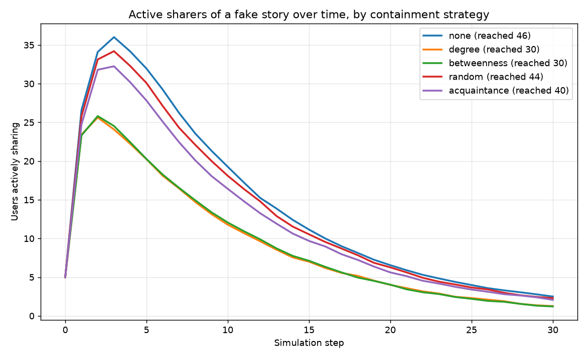

# Fake News Detection & Propagation Control

**Algorithms to spot fake news and stop it spreading across social media — an
end-to-end, runnable project with a step-by-step conceptual walkthrough.**

Misinformation is two problems, not one:

1. **Detection** — given a piece of text, decide whether it is *fake* or
   *credible*. This is a natural-language classification problem.
2. **Propagation control** — a story that is already loose on a social network
   spreads from user to user. Detecting it is useless unless you can also
   **slow or stop the cascade** with a limited budget of interventions. This is
   a graph / diffusion problem.

This repository tackles both, with clean code, unit tests, a CLI, a REST demo,
and — importantly — a conceptual explanation of *why* each algorithm works.

```
 text ─▶ preprocess ─▶ features ─▶ classifier ─▶ FAKE / REAL   (Part 1: detection)
                                        │
                                        ▼
        social graph ─▶ diffusion model ─▶ containment strategy   (Part 2: propagation)
                              │
                              ▼
        cascade shape ─▶ early detection / triage / evasion defence  (Part 3: hardening)
```

---

## Table of contents

- [Quick start](#quick-start)
- [Part 1 — Spotting fake news](#part-1--spotting-fake-news)
  - [Step 1: The data](#step-1-the-data)
  - [Step 2: Preprocessing](#step-2-preprocessing)
  - [Step 3: Features — lexical + stylometric](#step-3-features--lexical--stylometric)
  - [Step 4: The classifier](#step-4-the-classifier)
  - [Step 5: Evaluation](#step-5-evaluation)
  - [Step 6: Explainability](#step-6-explainability)
  - [Step 7: A fine-tuned transformer](#step-7-a-fine-tuned-transformer)
  - [Step 8: Benchmarking on real data](#step-8-benchmarking-on-real-data)
- [Part 2 — Stopping propagation](#part-2--stopping-propagation)
  - [Step 1: Modelling the network](#step-1-modelling-the-network)
  - [Step 2: Modelling the spread](#step-2-modelling-the-spread)
  - [Step 3: Containment strategies](#step-3-containment-strategies)
  - [Step 4: Greedy influence-maximisation](#step-4-greedy-influence-maximisation)
  - [Step 5: The result](#step-5-the-result)
- [Part 3 — Production hardening](#part-3--production-hardening)
  - [Surviving deliberate evasion](#surviving-deliberate-evasion)
  - [Knowing when *not* to answer](#knowing-when-not-to-answer)
  - [Detecting by shape, not words](#detecting-by-shape-not-words)
- [Project layout](#project-layout)
- [Using your own dataset](#using-your-own-dataset)
- [REST API](#rest-api)
- [Testing](#testing)
- [Further reading](#further-reading)

---

## Quick start

```bash
# 1. install
pip install -e .            # or: pip install -r requirements.txt

# 2. train the detector on the bundled synthetic dataset
python -m fakenews.cli train

# 3. score a headline (with feature attributions)
python -m fakenews.cli predict \
  "SHOCKING: doctors HATE this one weird trick, share before it is DELETED!!!" --explain

# 4. simulate misinformation spread and compare containment strategies
python -m fakenews.cli simulate --nodes 500 --runs 40
```

Everything runs **offline with zero downloads** — the sample dataset is
generated procedurally so the whole pipeline is reproducible in CI. A `Makefile`
wraps the common tasks (`make train`, `make predict`, `make simulate`, `make test`).

---

## Part 1 — Spotting fake news

### Step 1: The data

A supervised classifier learns from labelled examples: documents tagged `1`
(fake) or `0` (real). The bundled generator (`fakenews.data`) fabricates a
balanced corpus in which the two classes differ in **both vocabulary and
style** — real articles read like neutral wire copy ("The central bank reported
that inflation eased slightly"), fake ones like clickbait ("SHOCKING: secret
miracle cure they tried to censor!!!").

> **Why synthetic?** So the repo is self-contained and every run is
> reproducible. To train on real data, point the CLI at any CSV with `text` and
> `label` columns — see [Using your own dataset](#using-your-own-dataset).

### Step 2: Preprocessing

`fakenews.preprocess.clean_text` normalises documents: lower-casing, stripping
URLs and `@handles`/`#hashtags`, removing noise characters and collapsing
whitespace. Cleaning is deliberately **conservative** — we keep enough of the
raw text that the stylometric extractor can still count exclamation marks and
capital letters (both strong misinformation signals).

### Step 3: Features — lexical + stylometric

We give the model two complementary views of each document:

| View | What it captures | How |
|------|------------------|-----|
| **Lexical (TF-IDF)** | *What* is said — vocabulary, topical and clickbait n-grams | `TfidfVectorizer`, word 1- & 2-grams |
| **Stylometric** | *How* it is said — shouting, exclamation spam, clickbait triggers | 9 interpretable statistics |

The nine stylometric features (`fakenews.features.STYLOMETRIC_FEATURE_NAMES`)
include the uppercase ratio, exclamation/question ratios, clickbait-lexicon hit
rate and lexical diversity. **TF-IDF** ("term frequency × inverse document
frequency") up-weights words that are frequent in a document but rare across the
corpus, so distinctive phrasing dominates and boilerplate is discounted.

The two blocks are joined with a scikit-learn `FeatureUnion`, so preprocessing,
vectorisation and classification all live inside **one `Pipeline`** — training
and inference take the identical code path, eliminating train/serve skew.

### Step 4: The classifier

On top of the features sits a **linear classifier** (default: logistic
regression; also `passive_aggressive`, `linear_svm`, `naive_bayes`). Linear
models are the workhorse of text classification because:

- high-dimensional sparse TF-IDF vectors are (almost) linearly separable;
- training and prediction are fast;
- the weights are **directly interpretable** (Step 6).

```python
from fakenews.detect import FakeNewsDetector
detector = FakeNewsDetector()
detector.fit()                       # trains on the bundled dataset
print(detector.predict("BREAKING bombshell truth they hid from you!!!"))
# -> FAKE (99.3% confidence)
```

### Step 5: Evaluation

Accuracy alone is misleading. For misinformation we care most about **recall on
the fake class** (a missed fake keeps spreading) balanced against **precision**
(flagging real news as fake destroys trust). `fakenews.evaluate` reports
accuracy, per-class precision/recall/F1 and the confusion matrix. On the
separable synthetic data the pipeline reaches ~1.0 F1; on messy real corpora
expect 0.85–0.95.

### Step 6: Explainability

A moderation tool must justify itself. For linear models, a feature's
contribution to a specific decision is simply `feature_value × weight`.
`detector.explain(text)` returns the tokens and style features that pushed a
document toward its verdict:

```
+0.462  style__clickbait_ratio   -> fake
+0.379  tfidf__share before      -> fake
+0.379  tfidf__deleted           -> fake
```

### Step 7: A fine-tuned transformer

The linear model sees *words*, not *context*, so cleverly-worded misinformation
that dodges the obvious clickbait vocabulary can slip past it. A pretrained
**transformer** (DistilBERT) fixes that: it arrives already knowing English from
massive self-supervised pretraining, and **self-attention** lets every token be
represented *in context*. We only **fine-tune** it — a couple of epochs on our
labelled data — so it learns the task from a few hundred examples.

`TransformerDetector` mirrors the `FakeNewsDetector` interface exactly, so it's a
drop-in swap. It's an optional extra (needs `torch` + `transformers`):

```bash
pip install "fakenews[transformer]"
python -m fakenews.cli train   --arch transformer          # fine-tunes DistilBERT
python -m fakenews.cli predict --arch transformer "paraphrased misinformation here"
```

```python
from fakenews.transformer import TransformerDetector
det = TransformerDetector()
det.fit()                                   # downloads + fine-tunes
det.predict("BREAKING bombshell truth they hid from you!!!")   # -> FAKE
```

**Trade-off:** the transformer captures meaning the linear model can't, but costs
orders of magnitude more compute and loses the free per-feature explanations.
The linear model remains an excellent, interpretable default; reach for the
transformer when subtle, context-dependent phrasing matters.

### Step 8: Benchmarking on real data

One train/test split is one noisy number. To compare models *fairly* the
`benchmark` command runs **stratified k-fold cross-validation** — every model is
trained and tested on the identical folds — and reports mean ± standard
deviation, so you see both skill and stability:

```bash
python -m fakenews.cli benchmark --noise 0.3        # synthetic, deliberately hard
python -m fakenews.cli benchmark --dataset path/to/news.csv --cv 5
```

```
        classifier |      accuracy |     F1 (fake) |     fit
------------------------------------------------------------
       naive_bayes | 0.745 ± 0.041 | 0.740 ± 0.035 |   0.03s
          logistic | 0.680 ± 0.022 | 0.673 ± 0.026 |   0.04s
        linear_svm | 0.655 ± 0.015 | 0.641 ± 0.027 |   0.05s
passive_aggressive | 0.640 ± 0.037 | 0.590 ± 0.050 |   0.03s
```

The harness ships loaders for the two most common public corpora —
`fakenews.benchmark.load_liar` (the LIAR dataset) and `load_kaggle_fake_real`
(Kaggle *Fake and Real News*) — so pointing the benchmark at real data is a
one-liner. See [Using your own dataset](#using-your-own-dataset).

---

## Part 2 — Stopping propagation

Detection labels a story; it does not un-spread it. Part 2 asks: **given a
fixed budget of fact-checkers/monitors, which users should we deploy them on to
minimise how far a fake story travels?**



### Step 1: Modelling the network

Real social graphs are **scale-free**: a few "hub" accounts have enormous
followings while most users have few connections. We reproduce this with a
Barabási–Albert graph (`fakenews.propagation.build_social_graph`). Hubs are
what make misinformation explosive — and, as we'll see, what make it
containable.

### Step 2: Modelling the spread

We use the **Independent Cascade (IC)** model with SIR-style recovery:

- Every user is *susceptible*, *infected* (actively sharing) or *recovered*
  (saw it, moved on, or was immunised).
- Each step, an infected user infects each susceptible neighbour independently
  with probability `p` (the "virality"), then recovers with probability `r`.
- A handful of high-degree **seed** users start the cascade (worst case).

This is the misinformation analogue of an epidemic — hence "going viral" is
literally the right metaphor.

### Step 3: Containment strategies

A **monitor / fact-checker** node, once reached, debunks the story and refuses
to propagate — it is effectively *immunised* and blocks the cascade through it.
With a limited budget, *where* you place monitors is everything:

| Strategy | Idea | Needs global graph knowledge? |
|----------|------|-------------------------------|
| `degree` | Immunise the biggest hubs | Yes |
| `betweenness` | Immunise the best bridges between communities | Yes |
| `greedy` | Immunise the node that most reduces *simulated* spread, repeatedly | Yes (+ a simulator) |
| `acquaintance` | Pick a random user, immunise a random *friend* of theirs | **No** — local only |
| `random` | Immunise random users (null baseline) | No |
| `none` | Do nothing (measures the untamed cascade) | — |

The **acquaintance** strategy is the clever one: a random neighbour of a random
node is disproportionately likely to be a hub (the "friendship paradox"), so it
targets influential users **without ever needing a full map of the network** —
exactly the constraint a real platform faces.

### Step 4: Greedy influence-maximisation

The centrality heuristics are cheap *proxies* for the thing we actually care
about: expected spread. The **greedy** strategy optimises that objective
directly — each round it immunises the node whose removal reduces the simulated
cascade the most:

```
select monitors greedily:
  repeat until budget spent:
    for each candidate node v:
      estimate expected spread if we also immunise v   (Monte-Carlo)
    immunise the v with the largest reduction
```

A subtle but important point: influence **maximisation** (choosing seeds to
*spread* a message) is submodular, which is what lets the classic **CELF**
algorithm skip almost all re-evaluations. Node **immunisation** — choosing
blockers to *minimise* spread — is **not** submodular: removing one node can
*raise* another's value by putting it on a newly-critical path. We verified that
the lazy CELF shortcut picks a strictly worse set here, so the implementation
deliberately runs the exact greedy (re-evaluating every candidate each round),
restricted to a high-degree candidate pool for tractability. This is a nice
illustration of *why you must check the submodularity assumption before reaching
for the fast algorithm.* (Full discussion in [`docs/CONCEPTS.md`](docs/CONCEPTS.md).)

### Step 5: The result

Running `python -m fakenews.cli simulate` reproduces the core finding:

```
     strategy |  reached |   peak |  reduction vs none
--------------------------------------------------------
         none |     45.4 |   35.1 |              0.0%
       degree |     29.9 |   25.9 |             34.3%
  betweenness |     30.0 |   25.9 |             33.9%
       greedy |     29.9 |   25.9 |             34.3%
 acquaintance |     39.2 |   31.4 |             13.6%
       random |     43.1 |   33.7 |              5.0%
```

**Targeting hubs cuts total spread by a third**, and even the knowledge-free
acquaintance heuristic roughly triples the effectiveness of random monitoring.
Notice the **greedy** optimum lands right on top of `degree` — on scale-free
networks the cascade *must* funnel through hubs, so degree-immunisation is
already near-optimal. Greedy's value is that it reaches that optimum by
optimising the objective *directly*, making no assumption about which structural
property happens to matter; when the network isn't cleanly hub-dominated, the
cheap heuristics diverge and greedy keeps tracking the best of them.

The lesson: *spend your scarce fact-checking budget on the structurally
important accounts, not uniformly.*

---

## Part 3 — Production hardening

Parts 1 and 2 give a working detector and a containment plan. Deploying them
raises three problems that accuracy alone does not answer.

### Surviving deliberate evasion

Once a platform filters on words, operators obfuscate those words — while
keeping them perfectly readable to humans:

| Attack | Example | What the model sees |
|--------|---------|---------------------|
| Homoglyph | `vаccine` (Cyrillic а) | a different token |
| Zero-width | `vac\u200bcine` | two tokens |
| Leetspeak | `v4cc1n3` | out of vocabulary |
| Repetition | `shoooocking` | out of vocabulary |
| Letter spacing | `s h o c k i n g` | eight 1-char tokens |
| Diacritics | `shöcking` | a different token |

`fakenews.adversarial.deobfuscate` folds all six back to canonical ASCII, and —
critically — the module also *measures* the damage rather than assuming a fix:

```bash
python -m fakenews.cli robustness --rate 0.5 --lexical-only
```

```
      attack | undefended |  defended | recovered
-------------------------------------------------
   homoglyph |      0.987 |     1.000 |    +0.013
  zero_width |      0.900 |     1.000 |    +0.100
  repetition |      0.840 |     1.000 |    +0.160
```

Enable it in the pipeline with `ModelConfig(deobfuscate=True)`; it then runs
identically at train and predict time.

Two findings worth keeping: the **stylometric features are incidentally robust**
(shouting and `!!!` survive obfuscation, so the full model degrades less than a
lexical-only one), and the normaliser is deliberately conservative — `covid19`,
`2024`, `5G` and `BREAKING!!!` are provably left intact, which the test suite
enforces as a regression guard.

### Knowing when *not* to answer

A deployed moderation system must decide **which calls are safe to make
automatically**. `fakenews.triage` provides the three missing pieces:
probability **calibration** (so 0.9 means "right 90% of the time", measured by
Brier score and Expected Calibration Error), an **abstention policy** that
auto-decides only outside an uncertainty band, and **cost-sensitive thresholds**
for when a false negative is worse than a false positive.

```bash
python -m fakenews.cli triage --max-error 0.02 --fn-cost 5
```

`fit_policy` inverts the usual question. Instead of "how accurate is the model?"
it answers *"given that we tolerate at most 2% mistakes on automated calls, how
much of the queue can we automate?"* — the number an operations team plans
against. On a clean corpus that is 100% coverage; on a noisy one it correctly
collapses toward "send everything to a human" rather than quietly exceeding the
budget. Note the policy is fitted on a held-out split and still shows a
generalisation gap on fresh data, so in production it should be re-validated and
monitored, not set once.

### Detecting by shape, not words

`fakenews.earlydetect` classifies a story from **how it spreads** — using no
text at all. Following Vosoughi et al. (*Science*, 2018), false stories travel
deeper through longer person-to-person chains, while true ones are more often
broadcast once and stop. The discriminating measure is **structural virality**
(mean pairwise distance in the diffusion tree): a star-shaped broadcast scores
~1.8, a long chain ~4.0.

```bash
python -m fakenews.cli early-detect
```

```
 window  accuracy    f1     <- how long we watch the cascade
1 steps     0.557         near chance: indistinguishable
2 steps     0.610
3 steps     0.817         chains diverge; signal appears
   full     0.817         plateau -- watching longer adds nothing
```

This is worth reading carefully, because **the first version of this experiment
was wrong**. Seeding "real" cascades from hubs and "fake" ones from ordinary
users gave 98% accuracy after a *single* step — but that detector was reading
the poster's follower count, not the spread, and would collapse the moment a
fake story got posted by a popular account. The regimes are now seeded
identically and differ *only* in whether resharing chains persist, so any signal
has to come from structure. The honest result: you cannot tell at step 1, and by
step 3 you can. Depth-based features carry it (`mean_depth`, `max_depth`,
`structural_virality`), which is exactly what the theory predicts.

Being text-free makes this complementary to Part 1 — it is language-independent,
works on images and video, and cannot be evaded by rewording.

---

## Project layout

```
fake-news-detection/
├── src/fakenews/
│   ├── config.py         # all tunable hyper-parameters (dataclasses)
│   ├── data.py           # synthetic generator + CSV loader
│   ├── preprocess.py     # text normalisation
│   ├── features.py       # TF-IDF + stylometric transformers
│   ├── models.py         # pipeline construction + persistence
│   ├── evaluate.py       # metrics & reporting
│   ├── detect.py         # FakeNewsDetector — the high-level linear API
│   ├── transformer.py    # TransformerDetector — optional fine-tuned DistilBERT
│   ├── benchmark.py      # cross-validation harness + LIAR/Kaggle loaders
│   ├── adversarial.py    # evasion attacks + the deobfuscation defence
│   ├── triage.py         # calibration, abstention policy, cost-aware cutoffs
│   ├── earlydetect.py    # cascade-shape features + early detection
│   ├── propagation.py    # network, diffusion model, containment strategies
│   └── cli.py            # `python -m fakenews.cli ...`
├── app/api.py            # optional Flask REST demo
├── scripts/plot_propagation.py
├── tests/                # 126 tests (pytest), incl. industrial edge cases
├── docs/                 # CONCEPTS.md, ARCHITECTURE.md, figure
├── data/sample_news.csv  # generated sample dataset
├── Makefile              # make train | predict | simulate | test
└── pyproject.toml
```

See [`docs/CONCEPTS.md`](docs/CONCEPTS.md) for the deeper theory and
[`docs/ARCHITECTURE.md`](docs/ARCHITECTURE.md) for the design rationale.

## Using your own dataset

Any CSV with a text column and a binary label column works:

```bash
python -m fakenews.cli train --dataset path/to/news.csv --classifier passive_aggressive
```

Popular public options: the Kaggle *Fake and Real News* dataset, *LIAR*, or
*FakeNewsNet*. Map your columns to `text` / `label` (1 = fake) — the loader
handles the rename. For the two most common corpora there are purpose-built
loaders so you don't have to reshape anything:

```python
from fakenews.benchmark import load_liar, load_kaggle_fake_real, cross_validate_classifiers

df = load_liar("liar_dataset/train.tsv")                 # 6-way -> binary
# df = load_kaggle_fake_real("Fake.csv", "True.csv")
for row in cross_validate_classifiers(df, cv=5):
    print(row.format())
```

## REST API

```bash
pip install flask
python -m fakenews.cli train
python app/api.py         # http://127.0.0.1:5000
curl -s localhost:5000/predict -H 'Content-Type: application/json' \
     -d '{"text":"SHOCKING secret they tried to censor!!!"}'
```

## Testing

```bash
pip install pytest
pytest                    # 126 tests covering every module
```

`tests/test_edge_cases.py` is the industrial-hardening suite: empty and
whitespace-only documents, 200 kB inputs, emoji / CJK / RTL / mixed-script text,
control bytes, malformed and NaN-bearing CSVs, embedded delimiters, single-class
and 99:1-imbalanced training data, degenerate graphs (single node, disconnected,
budget larger than the network), probability boundaries, determinism, save/load
fidelity and concurrent prediction. Every case must either work or **fail
loudly** — a silent wrong answer is the one outcome that is never acceptable.
It found a real bug on first run: predicting on an *empty batch* crashed inside
scikit-learn instead of returning `[]`, which is now fixed and guarded.

## Further reading

- Kempe, Kleinberg & Tardos, *Maximizing the Spread of Influence through a
  Social Network* (2003) — the Independent Cascade model.
- Cohen, Havlin & ben-Avraham, *Efficient Immunization Strategies* (2003) — the
  acquaintance-immunisation / friendship-paradox result.
- Shu et al., *FakeNewsNet* (2018) — datasets and features for fake-news
  detection.

## License

MIT — see [LICENSE](LICENSE).
